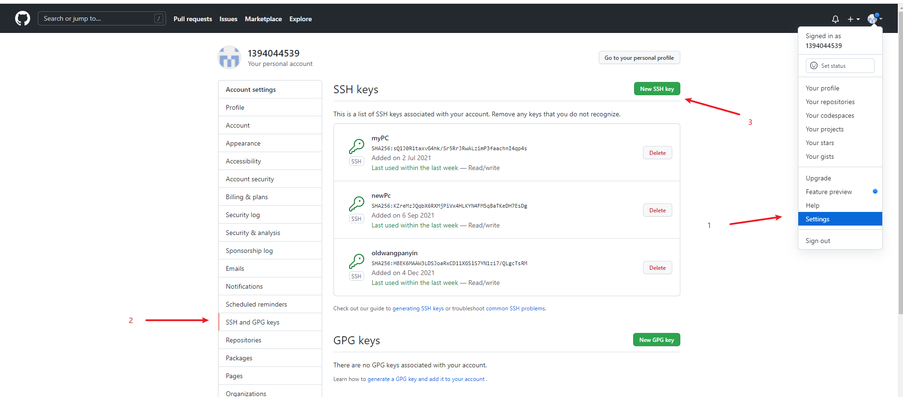
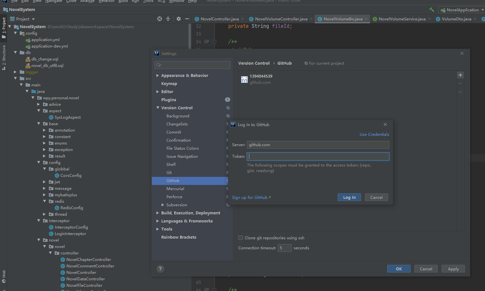
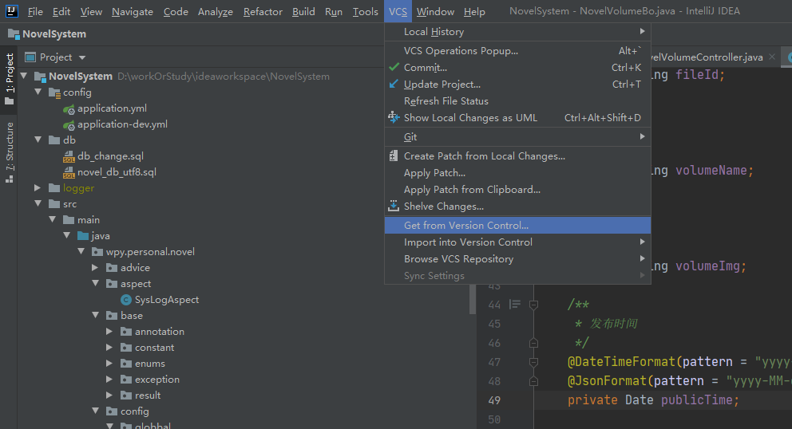
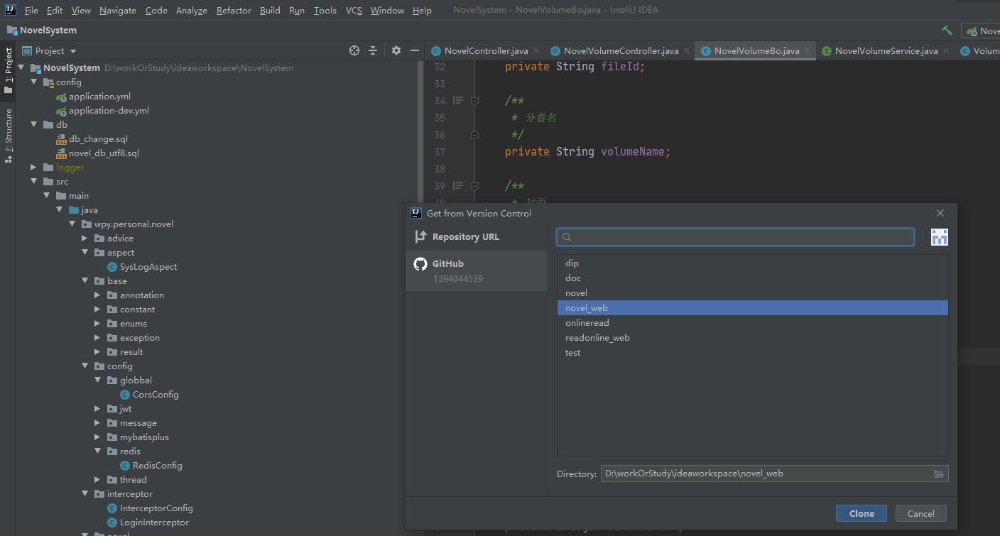

## 一、安装以及配置git

1、安装Git

去官网下载git：https://git-scm.com/downloads

点击开始安装，安装路径可以选择自己想要的，然后疯狂下一步，直到安装成功

2、配置

任意位置右键打开git Bash，在cmd窗口中输入以下命令配置自己的用户和邮箱

```bat
$ git config --global user.name "yourname"
$ git config --global user.email "youremail"
```

也可以通过如下命令查看当前git的配置

```bat
$ git config --list
```

配置gitbash中文

```bat
#gitbash
$ git config --global core.quotepath false
#git log
$ git config --global core.pager more
```

3、基本命令

```bat
#在当前文件下拉取git代码
$ git clone xxx
#拉取最新代码
$ git pull
#提交代码，三步走，add，commit，push
$ git add 文件名1 文件名2
$ git commit -m "备注，建议都加上，有时候git会设置成必须填写备注"
$ git push
```

4、分支管理

```bat
#无参数时会列出本地所有分支，带参数则是创建本地分支
$ git branch (branchname)
#切换分支，-b参数可以直接创建并切换到新分支
$ git checkout [-b] (branchname)
#合并，建议用可视化工具合并，少用命令的形式，会把其他分支合并到当前分支来
$ git merge (想要合并的分支)
#删除分支
$ git branch -d (branchname)
```

## 二、在线git仓库的设置（以github为例子）

本地想要直接访问github上面的仓库需要进行一些配置，我一般是设置SSH连接，不喜欢通过http

1、生成公钥

打开git Bash后输入以下命令

```bat
$ ssh-keygen -t rsa -C "你的github注册邮箱"
```

中间出现会让你设置密码，我一般不设置直接回车，然后他会自动生成公钥，一般是C:/user/你的用户名/ 下面有一个.ssh的文件夹，点进去有两个文件，id_rsa 和 id_rsa.pub，前一个是私钥，后一个就是公钥

2、在github上设置公钥

打开github页面，右上角用户头像->Setting->SSH and GPG keys，点击New SSH key按钮，然后起个名字把公钥里面的内容复制进来，就可以直接使用了




## 三、IDEA连接github

idea通过用户名和密码连接github似乎有一些问题，所以我推荐用token的形式进行联机

1、去github上生成一个token

同样是在Setting界面，找到Developer settings，点进去选择Personal access tokens，点击generate new token，输入你的github密码后进入设置，可以将token设置为永久，需要记住这个token

2、在idaa中配置

在setting中找到github，点击右上角的“+” ，在弹出的框右上角选择use Token，然后输入刚刚生成的token，idea就可以直接从github上拉取代码了

 

3、直接通过idea自带的方法拉取代码





## 四、TortoiseGit配置

小乌龟的git配置和本地的git配置是不同的

相关教程：https://blog.csdn.net/qq_32614411/article/details/84951156?utm_medium=distribute.pc_relevant_t0.none-task-blog-BlogCommendFromBaidu-1.control&depth_1-utm_source=distribute.pc_relevant_t0.none-task-blog-BlogCommendFromBaidu-1.control
